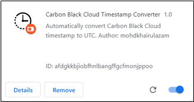
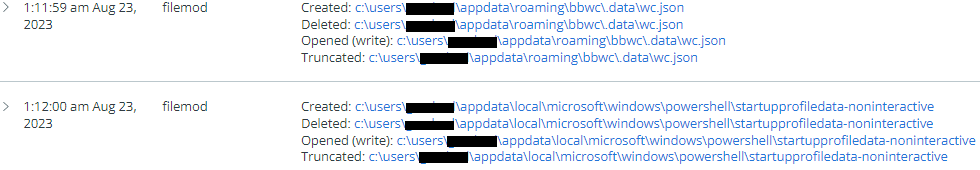
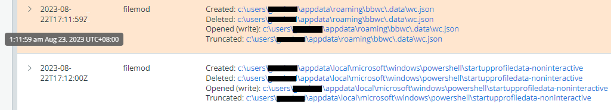

# CB_Cloud Console Timestamp Converter – Chrome Extension

This Chrome extension will automatically convert timestamp in Carbon Black Cloud portal into UTC.

 

<kbd></kbd>

Figure 1 – Before timestamp conversion

<kbd></kbd>

Figure 2 – After timestamp conversion

 

Also noted that original timestamp (in GMT/UTC +8) will be shown when you hover your cursor to the timestamp.

The timestamp format also has been adjusted so that you can copy the timestamp as CB search query syntax (YYYY-MM-DDThh:mm:dd).

## Instructions
1.	To install this Chrome extension, download and extract the zip file.
2.	Next, go to chrome://extensions/. Ensure “Developer mode” is enabled.
3.	Then, click “Load unpacked” and select folder of the extension.
4.	After that, you should see the extension listed.

## Changelogs
* v1.0   (30 Aug 2023): First version of the script.
